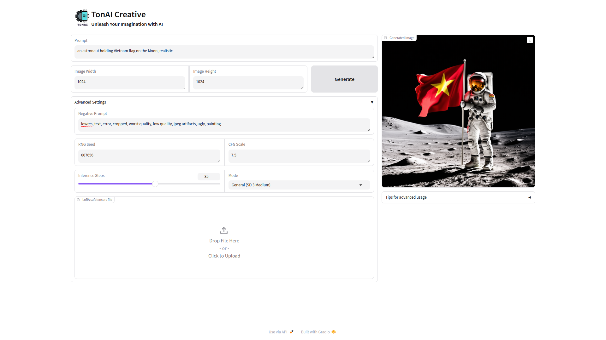
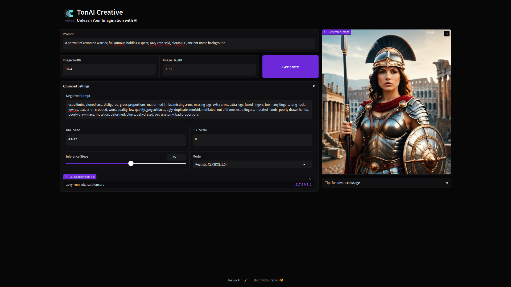

# TonAI Creative
An application for drawing picture with AI 



## Quick Start
### Basic Usage:
- **Prompt**: Enter the text prompt to generate your desired output. It should be less than 77 words.
- **Image Width** (and **Height**): Specify the width (and height) of the generated image.
- For SD 1.5 models, optimized sizes (w x h) are 768x768 (square), 512x864 (portrait), 864x512 (landscape). For SDXL and SD 3 models, optimized sizes (w x h) are 1024x1024 (square), 768x1152 (portrait), 1152x768 (landscape)
- You can read the [Resolution cheatsheat](https://www.reddit.com/r/StableDiffusion/comments/15c3rf6/sdxl_resolution_cheat_sheet/) to obtain more information.

### Advanced Usage:
- **Negative Prompt**: Text prompts that instruct the AI model that it should not include certain elements in its generated images.
- **CFG Scale**: A parameter that controls how much the image generation process follows the text prompt. The higher the value, the more the image sticks to a given text input.
- **Inference Step**: The number of steps the model takes to generate the output.
- **Mode**: Choose the style of image you want to generate.
- **LoRA safetensor File**: Upload a Low-Rank Adaptation (LoRA) safetensor file to fine-tune the model. You can seek the LoRA weight on the Internet, and add the tag with syntax `<lora:[scale]>` to your prompt. For example, you uploaded the LoRA file `Mod1_blah.safetensor`, you can indicate this object in prompt by calling `Mod1_blah` (your file name without extension) and tag `<lora:0.66>` (0.66 is the scale of adapter, default value is 1).

### More Information:
Except Stable Diffusion 3 Medium model, **TonAI Creative** uses `DPM++ 2M SDE Karras` Sampler for all pipelines. We value your feedback! Please share your thoughts and suggestions with us at tungnguyen99.tn@gmail.com

## Installation

### Minimum Requirements
- **GPU:** NVIDIA GTX 1050Ti or equivalent
- **RAM:** 8 GB
- **CPU:** Intel i5 or equivalent
- **Storage:** 50 GB of free space

### Recommended Requirements
- **GPU:** NVIDIA compute-oriented Ampere architecture (A100, A40, A30) or higher. For running Stable Diffusion 3 with full precision, GPUs with 40GB VRAM are required. With GPUs have less than 24GB VRAM, SD3 and SDXl can run with half-precision (Float16). Gaming GPUs like RTX 4090Ti are also good, but data center GPUs are highly recommended.
- **RAM:** 32 GB
- **CPU:** Intel i7 or equivalent
- **Storage:** 50 GB of free space

Sure, here is the installation guide written in Markdown format:

### Step 1: Install Anaconda

#### Ubuntu
1. Download the Anaconda installer script:
    ```bash
    wget https://repo.anaconda.com/archive/Anaconda3-2023.03-Linux-x86_64.sh
    ```
2. Run the installer script:
    ```bash
    bash Anaconda3-2023.03-Linux-x86_64.sh
    ```
3. Follow the prompts and restart your terminal or run:
    ```bash
    source ~/.bashrc
    ```

#### macOS
1. Download the Anaconda installer:
    - Visit [Anaconda Downloads](https://www.anaconda.com/products/distribution#download-section) and download the macOS installer.
2. Run the installer:
    ```bash
    bash ~/Downloads/Anaconda3-2023.03-MacOSX-x86_64.sh
    ```
3. Follow the prompts and restart your terminal or run:
    ```bash
    source ~/.bash_profile
    ```

#### Windows
1. Download the Anaconda installer:
    - Visit [Anaconda Downloads](https://www.anaconda.com/products/distribution#download-section) and download the Windows installer.
2. Run the installer and follow the prompts to complete the installation.
3. Open the Anaconda Prompt from the Start menu.

### Step 2: Create and Activate Conda Environment

1. Open your terminal (Anaconda Prompt on Windows).
2. Create a new conda environment named 'tonai' with Python 3.10:
    ```bash
    conda create -n tonai python=3.10
    ```
3. Activate the environment:
    ```bash
    conda activate tonai
    ```

### Step 3: Install Required Packages

1. Ensure you have `requirement.txt` file in your working directory.
2. Install the required packages using pip:
    ```bash
    pip install -r requirement.txt
    ```

## Usage
For running on local machine, from your Terminal (or CMD) run the command
```bash
python app.py
```
And your Web UI app will run on local URL:  http://127.0.0.1:7860

To deploy your app on your own server, refer [This Blog](https://www.gradio.app/guides/running-gradio-on-your-web-server-with-nginx)