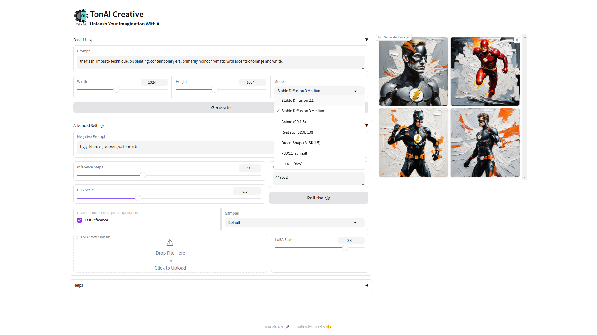
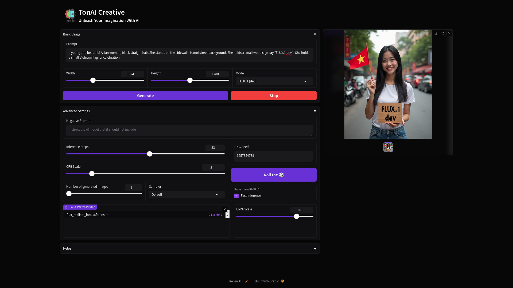

<p align="center">
  
</p>

# TonAI Creative
## An application for drawing picture with AI
<a href="http://huggingface.co/spaces/tungedng2710/TonAI-Creative"></a>

<!-- **Web Ui in light mode**

 -->
<!-- **Web Ui in dark mode** -->



## Quick Start
- **Prompt**: Enter the text prompt to generate your desired output. It should be less than 77 words.
- **Width** (and **Height**): Specify the width (and height) of the generated image.
- **Fast Inference**: Model will be quantized to FP16 (half precision) to boost the speed but the picture quality will be decreased a bit
- **Negative Prompt**: Text prompts that instruct the AI model that it should not include certain elements in its generated images.
- **CFG Scale**: A parameter that controls how much the image generation process follows the text prompt. The higher the value, the more the image sticks to a given text input.
- **Inference Step**: The number of steps the model takes to generate the output.
- **Mode**: Choose the style of image you want to generate.
- **LoRA safetensor File**: Upload a Low-Rank Adaptation (LoRA) safetensor file to fine-tune the model. You can seek the LoRA weight on the Internet. You can also adjust the  
- **Sampler**: Method of generating data in a specific way. Set its value as ```Default``` to use the default config of pipeline

## Installation

### Minimum Requirements
- **GPU:** NVIDIA GTX 1050Ti or equivalent
- **RAM:** 8 GB
- **CPU:** Intel i5 or equivalent
- **Storage:** 50 GB of free space

### Step 1: Install Anaconda
1. Install [Anaconda](https://www.anaconda.com/)
2. Create a new conda environment named 'tonai' with Python 3.10:
    ```bash
    conda create -n tonai python=3.10
    ```
3. Activate the environment:
    ```bash
    conda activate tonai
    ```

### Step 2: Install Required Packages

1. Ensure you have `requirement.txt` file in your working directory.
2. Install the required packages using pip:
    ```bash
    pip install -r requirement.txt
    ```

### Run the Web UI
For running on local machine, from your Terminal (or CMD) run the command
```bash
python app.py
```
And your Web UI app will run on local URL:  http://127.0.0.1:7860

To deploy your app on your own server, refer [This Blog](https://www.gradio.app/guides/running-gradio-on-your-web-server-with-nginx)
